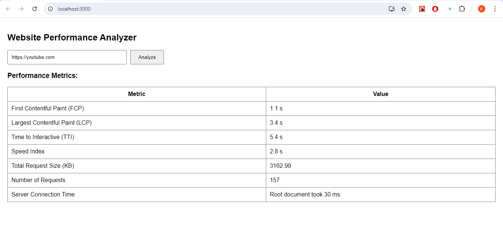

# Website Performance Analyzer

This React application analyzes the performance of a given website URL using Google's PageSpeed Insights API. It provides key performance metrics like First Contentful Paint (FCP), Largest Contentful Paint (LCP), Time to Interactive (TTI), Speed Index, Total Request Size, Number of Requests, Server Connection Time, and more.

# Video Demonstration - 

## Table of Contents
- [Introduction](#introduction)
- [Features](#features)
- [Technologies Used](#technologies-used)
- [Installation](#installation)
- [Usage](#usage)
- [Screenshots](#screenshots)
- [Contributing](#contributing)
- [Contact](#contact)

## Introduction
The goal of this project is to provide a comprehensive analysis of website performance, enabling users to easily interpret and analyze various performance metrics. The app leverages modern web technologies to deliver a responsive and interactive user experience.

## Features
- **Performance Metrics**: View key metrics like FCP, LCP, TTI, Speed Index, Total Request Size, Number of Requests, and Server Connection Time.
- **Error Handling**: Displays user-friendly error messages if the URL is invalid or if there is an issue with the API.
- **Responsive Design**: Optimized for various screen sizes and devices.

## Technologies Used
- **Frontend**: React
- **API Requests**: Axios
- **Styling**: CSS
- **Backend**: Node.js
- **Google PageSpeed Insights API**: The Google PageSpeed Insights API provides detailed performance metrics for any given URL, offering insights into the loading performance and user experience of the website.
- **State Management**: React useState Hook
- **Environment Variables**: `.env` file

## Installation
To set up the project locally, follow these steps:

1. **Clone the repository**:
    ```sh
    git clone https://github.com/kunalg3/web-analyzer.git
    cd web-analyzer
    ```

2. **Install dependencies**:
    ```sh
    npm install
    ```

3. **Run the development server**:
    ```sh
    npm start
    ```

4. **Open your browser and navigate to**:
    ```sh
    http://localhost:3000
    ```

## Usage
1. Enter the URL of the website you want to analyze in the input field.
2. Click the "Analyze" button.
3. The performance metrics will be displayed in a table below the input field.

## Screenshots

### Performance Metrics


## Contributing
Contributions are welcome! Please follow these steps to contribute:

1. Fork the repository.
2. Create a new branch (`git checkout -b feature-branch`).
3. Make your changes.
4. Commit your changes (`git commit -m 'Add new feature'`).
5. Push to the branch (`git push origin feature-branch`).
6. Create a Pull Request.

## Contact
For any questions or inquiries, please contact:
- **Name**: Kunal Goyal
- **Email**: kunalgoyal446@gmail.com
- **GitHub**: [kunalg3](https://github.com/kunalg3)
- **Phone**: +91 8266830511

Thank you for reviewing my project. Please let me know if you have any questions or require further information.
